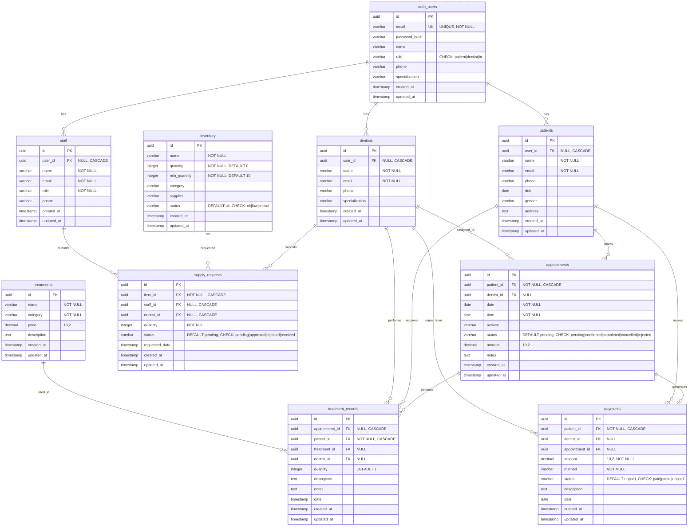

# Entity-Relationship Diagram (ERD)

## Database Schema Overview
This document describes the complete database schema for the Mouthworks Dental Clinic Management System.

## Entity-Relationship Diagram (Mermaid)

## Table Descriptions

### Core Identity Tables

#### auth_users
- **Purpose**: Central authentication and user management
- **Key Fields**: email (unique), role (patient/dentist/hr), password_hash
- **Relationships**: 
  - One-to-many with patients, dentists, staff
- **Note**: Parent table for all user types

#### patients
- **Purpose**: Patient demographic and contact information
- **Key Fields**: name, email, phone, dob, gender, address
- **Relationships**:
  - Linked to auth_users via user_id
  - One-to-many with appointments, treatment_records, payments

#### dentists
- **Purpose**: Dentist profiles and specializations
- **Key Fields**: name, email, phone, specialization
- **Relationships**:
  - Linked to auth_users via user_id
  - One-to-many with appointments, treatment_records, payments, supply_requests

#### staff
- **Purpose**: HR and administrative staff profiles
- **Key Fields**: name, email, role, phone
- **Relationships**:
  - Linked to auth_users via user_id
  - One-to-many with supply_requests

### Clinical Tables

#### appointments
- **Purpose**: Scheduling and appointment tracking
- **Key Fields**: patient_id, dentist_id, date, time, service, status, amount
- **Status Values**: pending, confirmed, completed, cancelled, rejected
- **Relationships**:
  - Many-to-one with patients (required)
  - Many-to-one with dentists (optional, assigned later)
  - One-to-many with treatment_records
  - One-to-one with payments

#### treatments
- **Purpose**: Service catalog with pricing
- **Key Fields**: name, category, price, description
- **Relationships**:
  - One-to-many with treatment_records
- **Note**: Defines available dental services

#### treatment_records
- **Purpose**: Detailed treatment history per appointment
- **Key Fields**: appointment_id, patient_id, treatment_id, dentist_id, quantity, description, notes
- **Relationships**:
  - Many-to-one with appointments
  - Many-to-one with patients (required)
  - Many-to-one with treatments
  - Many-to-one with dentists
- **Note**: Records actual procedures performed with quantities

### Financial Tables

#### payments
- **Purpose**: Transaction and billing records
- **Key Fields**: patient_id, dentist_id, appointment_id, amount, method, status, date
- **Status Values**: paid, partial, unpaid
- **Method Examples**: Cash, Card, Insurance
- **Relationships**:
  - Many-to-one with patients (required)
  - Many-to-one with dentists (for earnings tracking)
  - Many-to-one with appointments (links payment to visit)

### Inventory Tables

#### inventory
- **Purpose**: Supplies and equipment tracking
- **Key Fields**: name, quantity, min_quantity, category, supplier, status
- **Status Values**: ok, low, critical
- **Relationships**:
  - One-to-many with supply_requests

#### supply_requests
- **Purpose**: Staff/dentist supply requisitions
- **Key Fields**: item_id, staff_id, dentist_id, quantity, status, requested_date
- **Status Values**: pending, approved, rejected, received
- **Relationships**:
  - Many-to-one with inventory (required)
  - Many-to-one with staff (optional)
  - Many-to-one with dentists (optional)
- **Note**: Either staff_id or dentist_id must be set

## Key Indexes

| Table | Index | Purpose |
|-------|-------|---------|
| patients | idx_patients_email | Fast email lookups |
| appointments | idx_appointments_patient_id | Patient appointment history |
| appointments | idx_appointments_dentist_id | Dentist schedule queries |
| appointments | idx_appointments_date | Date-based filtering |
| payments | idx_payments_patient_id | Patient billing history |
| payments | idx_payments_dentist_id | Dentist earnings queries |
| treatments | idx_treatments_category | Category-based filtering |
| inventory | idx_inventory_status | Low-stock alerts |
| supply_requests | idx_supply_requests_status | Pending requests |

## Row-Level Security (RLS)

All tables except `auth_users` have RLS enabled with policies:

- **Patients**: Can view only their own data (appointments, payments, treatment_records)
- **Dentists**: Can view appointments assigned to them; full access to their treatments/earnings
- **HR/Staff**: Full access to all records across tables
- **Emergency Override**: Use `DISABLE_RLS_ALL.sql` for development; re-enable with proper policies for production

## Foreign Key Constraints

| From Table | Column | References | On Delete |
|------------|--------|------------|-----------|
| patients | user_id | auth_users(id) | CASCADE |
| dentists | user_id | auth_users(id) | CASCADE |
| staff | user_id | auth_users(id) | CASCADE |
| appointments | patient_id | patients(id) | CASCADE |
| appointments | dentist_id | dentists(id) | SET NULL |
| treatment_records | appointment_id | appointments(id) | CASCADE |
| treatment_records | patient_id | patients(id) | CASCADE |
| treatment_records | treatment_id | treatments(id) | SET NULL |
| treatment_records | dentist_id | dentists(id) | SET NULL |
| payments | patient_id | patients(id) | CASCADE |
| payments | dentist_id | dentists(id) | SET NULL |
| payments | appointment_id | appointments(id) | SET NULL |
| supply_requests | item_id | inventory(id) | CASCADE |
| supply_requests | staff_id | staff(id) | CASCADE |
| supply_requests | dentist_id | dentists(id) | CASCADE |

## Data Flow Summary

1. **User Registration**: auth_users → patients/dentists/staff
2. **Appointment Booking**: patients → appointments → dentist assignment
3. **Treatment**: appointments → treatment_records (with treatments catalog)
4. **Payment**: appointments → payments (linked to patient, dentist, appointment)
5. **Inventory**: supply_requests → inventory (staff/dentist requests)

## Notes

- All primary keys use `UUID` with `gen_random_uuid()`
- All tables include `created_at` and `updated_at` timestamps
- Enum-like fields use `CHECK` constraints for validation
- `CASCADE` deletes ensure referential integrity
- `SET NULL` on optional relationships preserves historical data
