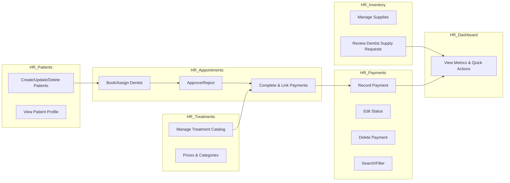
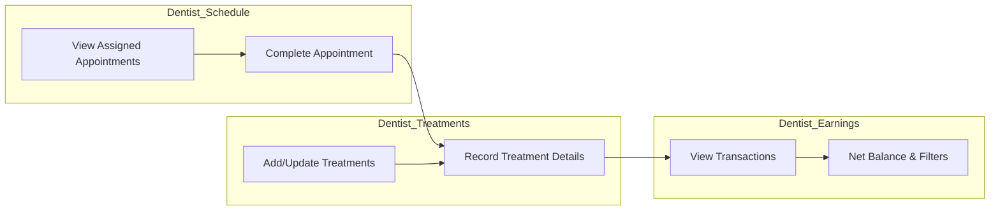
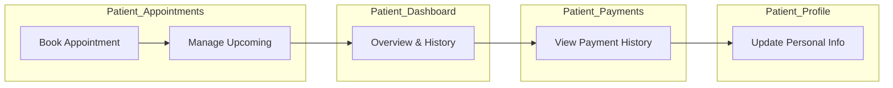
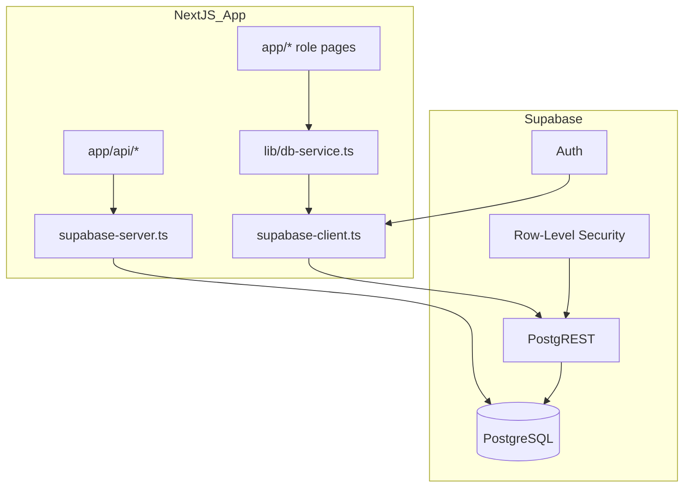
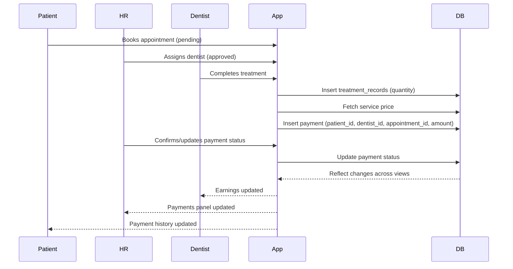
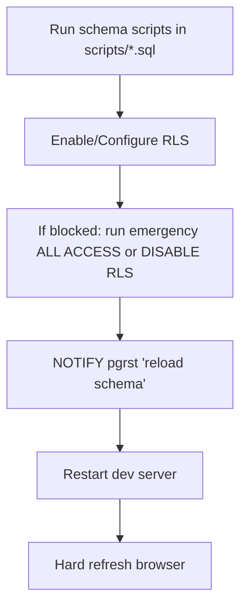
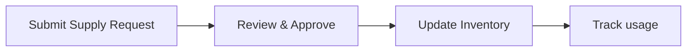

# Mouthworks System Flowcharts

Below are Mermaid diagrams outlining the full workflows across Patient, HR, and Dentist roles, including appointments, treatments, payments, and inventory.

## End-to-End Patient Journey
```mermaid
flowchart TD
  A[Patient: Book Appointment] --> B{Select Service & Date}
  B --> C[Create Appointment: status=pending]
  C --> D[HR: Assign Dentist]
  D --> E[Appointment: status=approved]
  E --> F[Patient Attends]
  F --> G[Dentist: Perform Treatment]
  G --> H[Record Treatment Records (with quantity)]
  H --> I[Dentist: Complete Appointment]
  I --> J[System: Fetch Service Price]
  J --> K[Create Payment (patient_id, dentist_id, appointment_id, amount, status)]
  K --> L{HR: Record/Confirm Payment}
  L -->|Paid| M[Update Payment status=paid]
  L -->|Partial/Unpaid| N[Maintain status]
  M --> O[Sync to HR Payments]
  M --> P[Sync to Dentist Earnings]
  M --> Q[Sync to Patient Payment History]
```

## HR Workflows


## Dentist Workflows


## Patient Workflows


## Data & Services Connectivity


## Payment Lifecycle


## RLS & Schema Maintenance


## Inventory & Supply Requests


## Notes
- Payments must include `patient_id`, `dentist_id`, `appointment_id`, `amount`, `status`, `method`, `date`.
- Treatment records include `quantity` to avoid completion errors.
- After DDL changes, use `NOTIFY pgrst, 'reload schema';` and restart dev.
